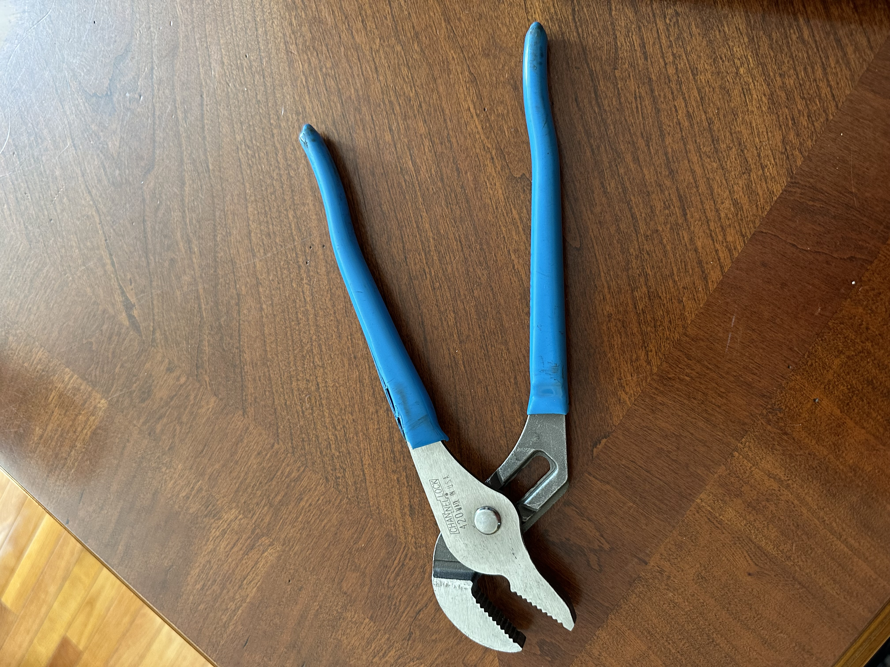
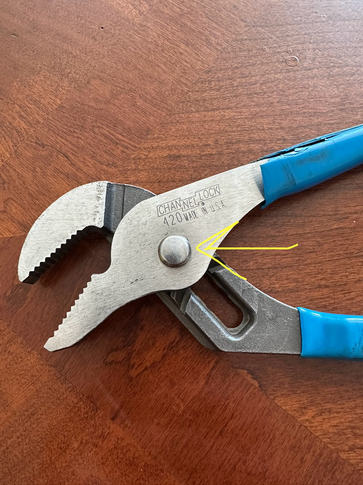
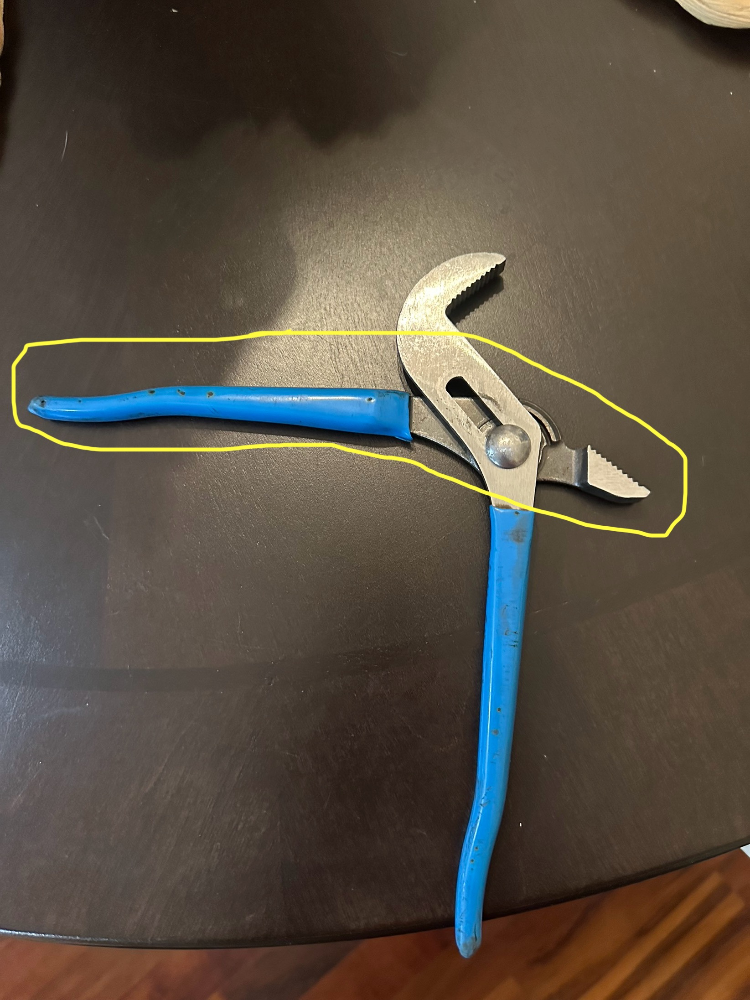
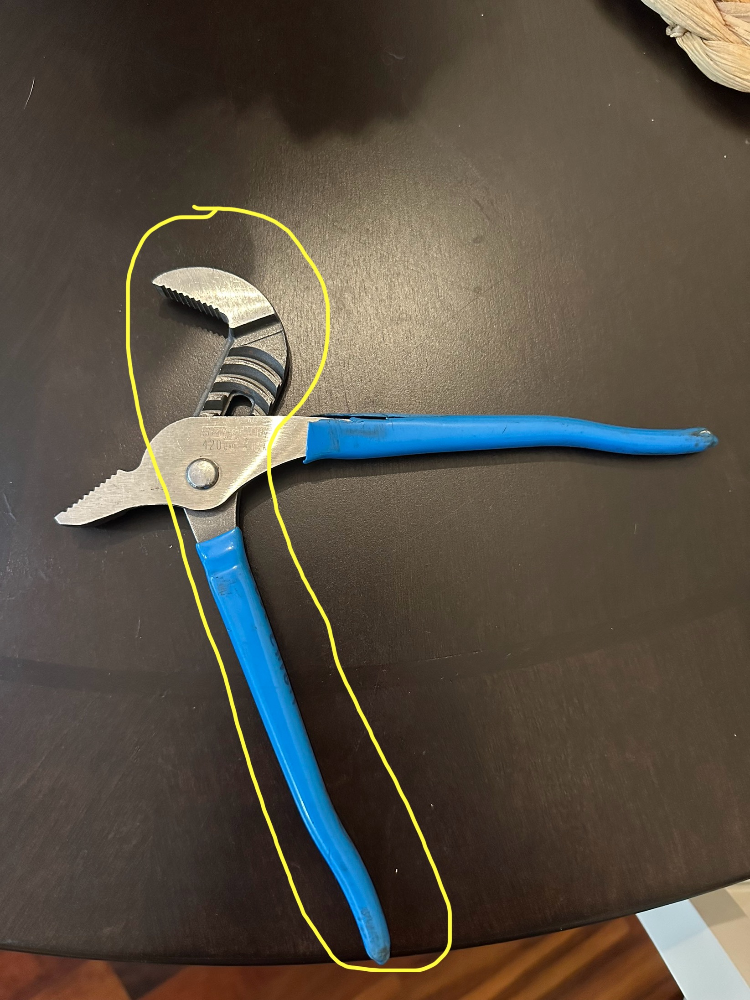

# A1 – Create Portfolio

## Objective
To build a professional portfolio

## Analyze

**Task A: Analyzing Portfolios**

Portfolio #1 - https://instructure.charlotte.edu/eportfolios/4933/landing-page-slash-welcome/welcome

The first portfolio that I found in Canvas was Parker Swart's from Spring 2026. I had no problem navigating through his portfolio. The first page that greets you is a welcome page that tells us what the portfolio consists of. To the right of the main page is his "About Me" tab which highlights his his life and why he chose to pursue mechanical engineering at UNC Charlotte. On the left side of the screen is his assignments tab. This revels his eleven assignments labeled 1-11 that he completed. The only thing that would make navigating the portfolio easier would be adding the assignment descriptions. The assignments had clear understanding. The assignments showed his work, problems, and solutions. That ultimately led to his finial products. Assignment #2 "Truss Stress" showed his pencil and paper work and his work in CAD. With this being said I think that Parker provided enough information to reproduce his work. Throughout Parkers assignments he used proper engineering grammar and language. 

Portfolio #2 - https://artemgomov.github.io/project-01.html

The second portfolio that I found was Artem Gomov's from Virginia Tech University. Artem's portfolio at first glance is very appealing to the eye. Everything is very easy to navigate for the reader. First you are presented with his "About Me" section that is very informative about his passion in formula SAE. It is also no problem finding the projects that he participated in during his time at Virginia Tech. His projects state his end goals and shows images of some of the pieces that went into his final products. Although I could not reproduce the work. This is because he does not explain or show how his decisions were made. Artem used proper grammar and language in his resume that he would provide to an employer. 

**Task B: Product Analysis**

CHANNELLOCK 420 Tongue and Groove Pilers. Patent US3192805A Howard H Manning

A. The primary function of the CHANNELLOCK 420 is to convert your hand force from gripping the handle to the jaws to clamp onto a external object. Then with an applied rotational torque the CHANNELLOCK rotates the external object. Mostly used to turn pipes, nuts, and bolts.

B. This product can be modeled as a lever in static equilibrium. The products governed physical principle is a moment equilibrium about a pivot. (F_hand)(L_hand)=(F_jaw)(L_jaw). The assumption is that the members and pivot are treated as ridged. Friction at the pivot is ignored. Which allows the hand force and the jaw force to be in relation using static torque equilibrium.  

C.

1. PERMALOCK fastener

The fastener connects the two piler arms together. It also is the joint at which the piler arms move. The Permalock fastener is the rotational connection that is necessary for the lever action. While use the fastener is what transfers forces between the two piler arms. While allowing the arms to rotate relative to each other. CHANNELLOCK describes the PERMALOCK fastener as increasing the joint strength and replacing the typical nut and bolt failure.

2. First piler arm

On the first piler arm the long handle provides a large moment arm from the pivot. This allows a small hand force to generate a larger force at the jaws. The jaw is much shorter than the handle, which increases mechanical advantage. The jaw puts a bite on the workpiece. Which increases friction and prevents slipping. The "tongue" is on the first piler. Which interacts with the groove section on the second piler that allows adjustment of the arms. This brings the jaws closer or farther apart. This allows a proper grip on the workpiece with the jaws.   

3. Second piler arm

The second piler arm works with the first arm to complete the lever mechanism. The long handle provides the input moment, while the jaw section transfers the moment into the clamping force. The "groove" is on this second piler. This groove allows the arm to interact with the tongue at different positions for adjustment.

D. Two alternate tools that could be used to solve the same primary function as the CHANNELLOCK. The first is an adjustable wrench (Crescent wrench). The second tool is a pipe wrench. In the design of the CHANNELLOCK a decision was made to put rubber on the handles. I think this was intended to improve grip and to soften the hand to handle contact.

## Decide

**Homepage identity:** The purpose of the homepage is to provide the reader an understanding of what the portfolio consists of and how it is organized. It shows the progression of our engineering projects. The portfolio also states how our projects follow the Analyze, Decide, and Communicate structure. Which outlines how our decisions as engineers are conducted. The homepage also states that our projects should build on one another.

**Intentional customization:** 

## Communicate

